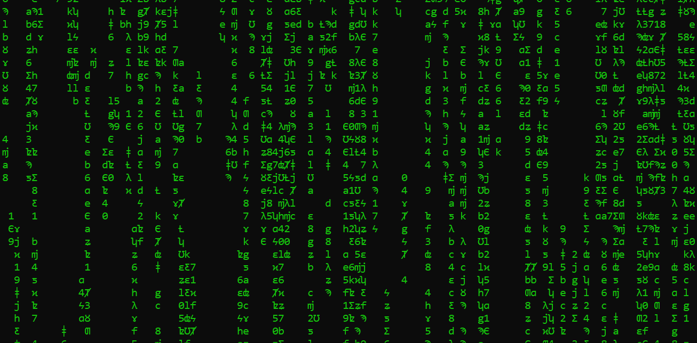

# C++ Matrix Digital Rain for the Windows Console

### Features
- Runs natively on the windows console
- C++
- Totally not useful, but I think it looks quite good (gif) :)

### How to use
- Just compile and run it

### 

My other project [Double buffered Windows Console](https://github.com/Kevger/DoubleBufferedWindowsConsole) is used for displaying the digital rain smoothly and without flickering on the windows console.
